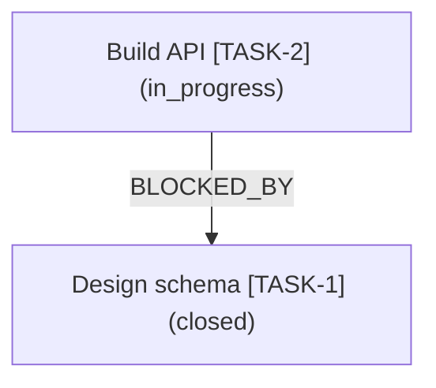

# pm-graph

Knowledge graph and dependency graph extension for [pm CLI](https://github.com/unbraind/pm-cli) workspaces, with optional Neo4j sync.

The extension reads the current workspace through `pm list-all --json` and `pm deps <id> --json`, then turns items, parent links, `blocked_by` metadata, dependency metadata, tags, statuses, types, assignees, sprints, and releases into graph nodes and relationships.

It can sync that graph into Neo4j, or export it offline to **Mermaid**, **Graphviz DOT**, **JSON Graph**, **Cypher**, **GraphML**, or **PlantUML** via `pm pm-graph export` — with neighborhood (`--root`/`--depth`), edge-type (`--edges`), and node (`--filter type=...|status=...`) shaping.

> **Note:** pm-cli 2026.7.18 introduced a built-in `pm graph` command group (bounded traversals, analytics, and governance audit over the workspace relationship graph). pm-graph complements it with Neo4j sync and multi-format visual/diagram exports. The package's exporter adapter is registered as `graph-export` (`pm graph-export export`) so it does not collide with the core command.

It also ships **offline graph analytics** (no Neo4j required): `pm pm-graph analyze`, `explain`, `cycles`, `path`, `critical-path`, `topo-sort`, and `impact` run dependency-cycle detection, item-centric dependency inspection, shortest-path, longest-chain, topological ordering, downstream-impact, orphan/root/leaf, bottleneck connector, and centrality analysis directly against your workspace.

## Quick Start

**Step 1 — Install the extension:**

```bash
pm install github.com/unbraind/pm-graph
pm pm-graph ping
```

**Step 2 — Configure Neo4j environment variables** (only needed for `sync`, `status`, `query`, `neighbors`):

```bash
export NEO4J_URI=bolt://localhost:7687
export NEO4J_USER=neo4j
export NEO4J_PASSWORD=change-me
```

**Step 3 — Sync your workspace to Neo4j:**

```bash
pm pm-graph sync --json
```

That's it. Open Neo4j Browser at `http://localhost:7474` to explore your graph.

## Install

```bash
pm install github.com/unbraind/pm-graph
pm pm-graph ping
```

To reinstall or update:

```bash
pm install github.com/unbraind/pm-graph --force
```

## Environment Variables

| Variable | Required | Description |
|---|---|---|
| `NEO4J_URI` | Yes (for Neo4j commands) | Bolt URI, e.g. `bolt://localhost:7687` |
| `NEO4J_USER` | Yes (for Neo4j commands) | Neo4j username, e.g. `neo4j` |
| `NEO4J_PASSWORD` | Yes (for Neo4j commands) | Neo4j password |
| `NEO4J_DATABASE` | No | Target database (defaults to server default) |
| `PM_GRAPH_PROJECT_KEY` | No | Override the project key (defaults to workspace directory name) |

The commands `export`, `cypher`, `analyze`, `cycles`, `path`, `critical-path`, `topo-sort`, and `impact`, plus the `graph-export` exporter adapter, do not require Neo4j at all.

## Commands

### `pm pm-graph ping`

Verify that the extension is active. Returns the extension version and whether Neo4j is configured.

```bash
pm pm-graph ping --json
```

Example output:

```json
{
  "ok": true,
  "source": "pm-graph",
  "neo4jConfigured": true,
  "version": "0.2.0"
}
```

### `pm pm-graph export`

Export the current workspace as a dependency and knowledge graph in JSON format. Returns `nodes`, `relationships`, and a `projectKey`. **Does not require Neo4j.**

```bash
pm pm-graph export --json
```

Example output (abbreviated):

```json
{
  "ok": true,
  "graph": {
    "generatedAt": "2026-05-14T10:00:00.000Z",
    "workspace": "/path/to/workspace",
    "projectKey": "my-project",
    "nodes": [
      { "id": "TASK-1", "labels": ["PmItem", "task"], "properties": { "title": "Build API", "status": "in_progress" } }
    ],
    "relationships": [
      { "from": "TASK-2", "to": "TASK-1", "type": "BLOCKED_BY", "properties": {} }
    ]
  }
}
```

Pass `--format <cypher|mermaid|dot|json|graphml|plantuml>` to render the graph into an offline format on stdout instead of the default graph object. `--format json` emits a valid JSON Graph (`nodes`/`edges`) document on stdout (parseable with `JSON.parse`), so it is the right choice for piping into other tools. The default (no `--format`) and `--json` behaviours are unchanged.

```bash
pm pm-graph export --format json | jq '.graph.nodes | length'
pm pm-graph export --format mermaid > graph.mmd
pm pm-graph export --format dot --output graph.dot        # write to a file
pm pm-graph export --format graphml --output graph.graphml # GraphML XML for yEd / Gephi / NetworkX
pm pm-graph export --format plantuml --output graph.puml   # PlantUML object diagram
```

Shape the exported graph (works with and without `--format`; once any shaping flag is used, closed/canceled items are excluded unless `--include-closed` is set):

```bash
# Dependency edges only (drop facet + tag edges)
pm pm-graph export --format mermaid --edges deps

# Only tag relationships
pm pm-graph export --format mermaid --edges tags

# 2-hop neighborhood around one item (undirected reachability)
pm pm-graph export --format dot --root TASK-42 --depth 2

# Include closed/canceled items (excluded once shaping is requested)
pm pm-graph export --format json --include-closed

# Scope to Task items that are open or in_progress
pm pm-graph export --format dot --filter type=Task --filter status=open,in_progress
```

| Flag | Values | Default | Description |
|---|---|---|---|
| `--format` | `cypher` \| `mermaid` \| `dot` \| `json` \| `graphml` \| `plantuml` | graph object | Output format. `mermaid` emits a `graph TD` flowchart; `dot` emits Graphviz `digraph`; `json` emits a JSON Graph (`nodes`/`edges`) document; `cypher` reuses the parameterized Neo4j import statements; `graphml` emits a valid GraphML XML document for yEd / Gephi / NetworkX; `plantuml` emits a `@startuml`…`@enduml` object diagram. |
| `--output <file>` | path | — | Write the rendered format to this file instead of stdout (requires `--format`). |
| `--edges <deps\|tags\|all>` | `deps` \| `tags` \| `all` | `all` | `deps` keeps dependency/structural edges (`BLOCKED_BY`, `CHILD_OF`, dependency kinds); `tags` keeps only `TAGGED_WITH`; `all` keeps everything including facet edges. |
| `--root <id>` | item id | — | Restrict the graph to the neighborhood around this node. |
| `--depth <n>` | non-negative integer | unlimited | Max hops from `--root` (undirected). Requires `--root`. |
| `--filter type=...\|status=...` | `key=value[,value]` (repeatable) | — | Keep only PmItem nodes matching the given `type`/`status`. Values for the same key are ORed (including repeated flags); distinct keys are ANDed. Non-item nodes (facets/tags) are always kept. Case-insensitive. |
| `--include-closed` | flag | off (when shaping) | Keep `closed`/`canceled` items once a shaping flag (`--edges`/`--root`/`--depth`/`--filter`) is used. On its own it is a no-op: calls without shaping flags keep the full legacy graph, closed items included. |

### `pm pm-graph cypher`

Render parameterized Cypher statements for importing the current workspace graph into Neo4j. Returns the statements without executing them. **Does not require Neo4j.**

```bash
pm pm-graph cypher --json
```

Example output (abbreviated):

```json
{
  "ok": true,
  "graph": { "nodes": 12, "relationships": 8 },
  "statements": [
    {
      "statement": "MATCH (n:PmGraphNode {projectKey: $projectKey}) DETACH DELETE n",
      "parameters": { "projectKey": "my-project" }
    }
  ]
}
```

### `graph-export` exporter adapter (`pm graph-export export`)

The same offline export pipeline is also registered with pm's native exporter registry under the adapter name `graph-export` (mirroring pm-csv's `csv-export`), which auto-creates the `pm graph-export export [file]` command. It is fully offline and never touches Neo4j.

> Before pm-graph 2026.7.18 the adapter was named `graph` (invoked as `pm graph export`). pm-cli 2026.7.18 introduced a built-in `pm graph` command group, so the adapter was renamed to avoid grafting extension subcommands onto the core command. Note that the auto-generated adapter command currently drops its option contracts on the CLI surface (upstream [pm-cli#574](https://github.com/unbraind/pm-cli/issues/574)) — prefer the canonical `pm pm-graph export`, which exposes the full `--format`/`--output`/shaping flag set documented above.

Example output (`pm pm-graph export --format mermaid --edges deps`):



### `pm pm-graph sync`

Sync the current workspace graph into Neo4j using the `NEO4J_*` environment variables.

- **Default (incremental):** Upserts all nodes and relationships, then deletes stale nodes that are no longer present in the workspace.
- **`--full`:** Performs a complete wipe-and-resync — deletes all `PmGraphNode` entries for the project before re-importing.

After every sync, a `lastSyncedAt` timestamp is stored in a `PmGraphSync` metadata node in Neo4j.

```bash
pm pm-graph sync --json          # incremental
pm pm-graph sync --full --json   # complete resync
```

Example output:

```json
{
  "ok": true,
  "projectKey": "my-project",
  "syncedNodes": 18,
  "syncedRelationships": 11,
  "deletedStaleNodes": 0,
  "fullSync": false
}
```

### `pm pm-graph status`

Show Neo4j configuration status, node and relationship counts for the current project, local pm item count, the last sync timestamp, and the extension version.

```bash
pm pm-graph status --json
```

Example output (Neo4j connected):

```json
{
  "ok": true,
  "neo4jConfigured": true,
  "projectKey": "my-project",
  "workspace": "/path/to/workspace",
  "localItemCount": 15,
  "nodeCount": 18,
  "relationshipCount": 11,
  "lastSyncedAt": "2026-05-14T10:00:00.000Z",
  "syncVersion": "0.2.0",
  "version": "0.2.0"
}
```

Example output (Neo4j not configured):

```json
{
  "ok": true,
  "neo4jConfigured": false,
  "message": "Neo4j is not configured. Set NEO4J_URI, NEO4J_USER, NEO4J_PASSWORD before using this command.",
  "projectKey": "my-project",
  "workspace": "/path/to/workspace",
  "localItemCount": 15,
  "version": "0.2.0"
}
```

### `pm pm-graph query`

Run a **read-only** Cypher query against Neo4j and return JSON results. Destructive Cypher keywords (`CREATE`, `MERGE`, `DELETE`, `DETACH`, `DROP`, `REMOVE`, `SET`) are blocked to prevent accidental data modification.

```bash
pm pm-graph query "MATCH (n:PmGraphNode {projectKey: 'my-project'}) RETURN n.id, n.title LIMIT 10" --json
```

Example output:

```json
{
  "ok": true,
  "count": 2,
  "records": [
    { "n.id": "TASK-1", "n.title": "Build API" },
    { "n.id": "TASK-2", "n.title": "Write tests" }
  ]
}
```

### `pm pm-graph neighbors`

Return all 1-hop neighbors with relationships for a given node ID. Each neighbor includes the relationship type, direction (`outgoing` or `incoming`), and properties.

```bash
pm pm-graph neighbors TASK-42 --json
```

Example output:

```json
{
  "ok": true,
  "center": { "id": "TASK-42", "title": "Deploy service", "_labels": ["PmItem", "task"] },
  "neighbors": [
    {
      "node": { "id": "TASK-10", "title": "Build service" },
      "relationship": { "type": "BLOCKED_BY", "direction": "outgoing", "properties": {} }
    }
  ]
}
```

## Offline Analytics

These commands analyze the workspace dependency graph **entirely offline** — no Neo4j required. They operate on **structural edges only** (`BLOCKED_BY`, `CHILD_OF`, and dependency edges such as `BLOCKS`/`RELATED`) between real items; facet edges (type/status/assignee/sprint/release) and tag edges are deliberately excluded so cycle, path, and centrality results stay meaningful.

Closed/canceled items are excluded by default; pass `--include-closed` to keep them. `analyze`, `cycles`, `critical-path`, and `topo-sort` also accept `--root <id>` / `--depth <n>` to scope the analysis to a neighborhood. All analytics commands accept `--filter type=...|status=...` to keep only items matching the given type/status (same-key values are ORed; distinct keys are ANDed); non-item nodes (facets/tags) are always kept. `cycles` and `critical-path` additionally accept `--format <text|mermaid|graphml|dot>` (default `text`) to render the relevant subgraph as a diagram for docs — `dot` emits a Graphviz `digraph` consumable by `dot`, `neato`, etc.

### `pm pm-graph analyze`

Comprehensive graph-health report: dependency-cycle count, orphan items (no edges), root items (no incoming dependency), leaf items (no outgoing dependency), longest dependency chain, top-N degree-centrality items, connected-component count, blocked-item count, and bottleneck connectors.

```bash
pm pm-graph analyze --json
pm pm-graph analyze --root pm-ep18 --depth 2 --json
pm pm-graph analyze --include-closed --json
```

Example output (abbreviated):

```json
{
  "ok": true,
  "itemCount": 7,
  "structuralEdgeCount": 6,
  "cycleCount": 1,
  "cycles": [["pm-oj3m", "pm-zc3a", "pm-oj3m"]],
  "orphans": ["pm-op0k"],
  "roots": ["pm-ep18"],
  "leaves": ["pm-hd71"],
  "longestChainLength": 4,
  "longestChain": ["pm-ep18", "pm-k849", "pm-p2q3", "pm-hd71"],
  "connectedComponents": 3,
  "blockedItemCount": 5,
  "topDegreeCentrality": [{ "id": "pm-ep18", "degree": 2, "inDegree": 0, "outDegree": 2 }],
  "maxDepth": 3,
  "depthByItem": [{ "id": "pm-hd71", "depth": 3 }, { "id": "pm-p2q3", "depth": 2 }],
  "articulationPoints": ["pm-p2q3"],
  "bridgeEdges": [{ "from": "pm-k849", "to": "pm-p2q3" }]
}
```

The `maxDepth` and `depthByItem` fields report the **dependency depth** of each item — the number of edges on the longest directed structural path starting at the item (its distance to a leaf along blocker edges). A leaf has depth `0`; `maxDepth` equals the critical-path depth. `depthByItem` is sorted deepest-first. These fields are additive; all previously emitted fields are unchanged.

The `articulationPoints` and `bridgeEdges` fields report bottlenecks in the
undirected structural projection: an articulation point is an item whose removal
disconnects part of the dependency context, and a bridge edge is a structural
item-to-item link whose removal does the same. These are useful for spotting
single points of coordination failure in a large pm workspace.

### `pm pm-graph cycles`

Detect and list dependency cycles. Each cycle is printed as an ordered id path (first id equals last). **Exits with code 1 when any cycle exists** (so it can gate CI) and exits 0 when there are none.

```bash
pm pm-graph cycles                     # human-readable; exit 1 if cycles found
pm pm-graph cycles --json              # machine-readable
pm pm-graph cycles --format mermaid    # render the cycle subgraph as Mermaid, then exit 1
pm pm-graph cycles --format graphml    # render the cycle subgraph as GraphML, then exit 1
pm pm-graph cycles --format dot       # render the cycle subgraph as a Graphviz digraph, then exit 1
pm pm-graph cycles --filter type=Task # scope to Task items only before detecting cycles
```

```jsonc
// no cycles -> exit 0
{ "ok": true, "cycleCount": 0, "cycles": [] }
```

Pass `--format mermaid`, `--format graphml`, or `--format dot` to visualize **only the cycle-participating** nodes and edges (the union of every detected cycle) as a diagram. The diagram is printed to stdout first, then the command still **exits 1** so it keeps gating CI. The subgraph is rendered with the same renderers as `pm graph export`, so it embeds directly in docs. `--format text` (the default) is unchanged. When there are no cycles, `--format` is a no-op (an empty diagram is meaningless) and the normal exit-0 result is returned.

### `pm pm-graph path`

Shortest **directed** dependency path between two item ids via BFS over structural edges. Missing arguments yield a usage error (exit 2); an unknown id yields a not-found error (exit 3).

```bash
pm pm-graph path pm-ep18 pm-hd71 --json
```

```json
{ "ok": true, "from": "pm-ep18", "to": "pm-hd71", "found": true, "path": ["pm-ep18", "pm-hd71"], "length": 1 }
```

### `pm pm-graph explain`

Explain one item in a single offline report: immediate blockers, immediate dependents, transitive downstream impact, dependency depth, critical chain from the item, and cycle participation.

```bash
pm pm-graph explain pm-ep18 --json
pm pm-graph explain pm-ep18 --include-closed --json
```

```json
{
  "ok": true,
  "id": "pm-ep18",
  "item": { "id": "pm-ep18", "title": "Platform baseline", "type": "Task", "status": "in_progress" },
  "blockers": [{ "id": "pm-k849", "title": "Schema migration", "relationTypes": ["BLOCKED_BY"] }],
  "dependents": [{ "id": "pm-y7ht", "title": "Write docs", "relationTypes": ["BLOCKED_BY"] }],
  "transitiveDependents": ["pm-y7ht", "pm-z19r"],
  "dependencyDepth": 2,
  "criticalChainFromItem": ["pm-ep18", "pm-k849", "pm-p2q3"],
  "inCycle": false,
  "cycleCount": 0,
  "cycles": []
}
```

If the id is unknown, the command returns a not-found error and includes nearest id suggestions when available.

### `pm pm-graph critical-path`

The longest chain of blocking dependencies through the workspace — the critical path — as an ordered id list with its length. Cycle-safe.

```bash
pm pm-graph critical-path --json
pm pm-graph critical-path --format mermaid     # render the critical-path chain as Mermaid
pm pm-graph critical-path --format graphml     # render the critical-path chain as GraphML
pm pm-graph critical-path --format dot          # render the critical-path chain as a Graphviz digraph
pm pm-graph critical-path --filter type=Epic    # scope the critical path to Epic items
```

```json
{ "ok": true, "length": 4, "path": ["pm-ep18", "pm-k849", "pm-p2q3", "pm-hd71"] }
```

Pass `--format mermaid`, `--format graphml`, or `--format dot` to print the critical-path **chain** as a diagram — exactly the chain nodes plus the edges connecting them — to stdout, reusing the same renderers as `pm graph export`. `--format text` (the default) returns the result object unchanged.

### `pm pm-graph topo-sort`

Emit a valid **topological execution order** of items over structural edges (Kahn's algorithm), so each item is listed only after the items it depends on. Ties are broken by ascending id for deterministic output. **Exits with code 1 when a dependency cycle prevents a complete ordering** (CI-usable), reporting the cycle members and the resolvable prefix. Accepts `--root`/`--depth`/`--include-closed`.

```bash
pm pm-graph topo-sort --json
```

```json
{
  "ok": true,
  "count": 6,
  "cyclic": false,
  "order": ["pm-p030", "pm-ijd7", "pm-vc4q", "pm-yol1", "pm-0wtl", "pm-8k1m"]
}
```

### `pm pm-graph impact`

List every item **transitively blocked-by / downstream** of a given item id — the reverse-reachable set following edge direction. Complements `path` and `neighbors`. A missing id yields a not-found error (exit 3); no id yields a usage error (exit 2).

```bash
pm pm-graph impact pm-vc4q --json
```

```json
{ "ok": true, "id": "pm-vc4q", "count": 3, "impacted": ["pm-0wtl", "pm-8k1m", "pm-yol1"] }
```

## Graph Model

- **`PmItem`** nodes for real pm items, labelled with item type (e.g. `task`, `bug`).
- **`ExternalPmItem`** nodes for dependency targets referenced but not present in the current workspace.
- **`PmFacet`** nodes for metadata: type, status, assignee, sprint, release, and tags.
- **`PmGraphSync`** metadata node storing the last sync timestamp and extension version per project.

Relationships: `CHILD_OF`, `BLOCKED_BY`, dependency relationship types from `pm deps`, `HAS_TYPE`, `HAS_STATUS`, `ASSIGNED_TO`, `IN_SPRINT`, `IN_RELEASE`, `TAGGED_WITH`.

All nodes in Neo4j carry the label `PmGraphNode` in addition to their semantic labels, making it easy to scope queries to a project:

```cypher
MATCH (n:PmGraphNode {projectKey: 'my-project'}) RETURN n LIMIT 25
```

## Error Handling

- Missing environment variables produce clear messages listing exactly which variables are unset.
- Neo4j connection failures (unreachable host, wrong credentials) produce actionable error messages rather than raw driver errors.
- The `query` command blocks destructive Cypher keywords to protect data integrity.
- The Neo4j driver is created with `connectionAcquisitionTimeout: 10s` and `maxConnectionLifetime: 5min`.
- Driver sessions are always closed in `finally` blocks to prevent connection leaks.

## Development

```bash
cd /path/to/pm-graph
npm install
npm run build
pm install --project .
pm pm-graph ping
```

## Release Automation

This package is release-ready for GitHub, npm, and Bun-compatible installs. CI runs type checking, build, production dependency audit, package packing, Bun install verification, and pm-changelog validation. The daily release workflow publishes only when commits exist after the latest release tag and uses pm-changelog to generate CHANGELOG.md and GitHub release notes.

## Multi-agent merge safety

This repo tracks its project management in `.agents/pm/` and ships a committed `.gitattributes`
that maps those tracker artifacts to pm-cli's field-aware Git merge drivers, so concurrent-branch
tracker edits merge cleanly instead of hard-conflicting. The driver definitions live in per-clone
Git config; `npm install` / `npm ci` wires them automatically via the `prepare` script
(`pm merge install`). To (re)run manually: `npm run merge:install`. After merging a branch that
touched `.agents/pm/`, run `pm history-repair --all` to reconcile history verification.
