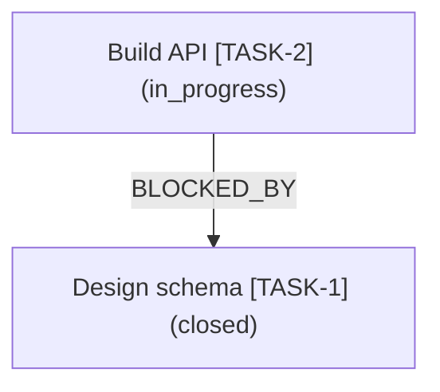

# pm-graph

Knowledge graph and dependency graph extension for [pm CLI](https://github.com/unbraind/pm-cli) workspaces, with optional Neo4j sync.

The extension reads the current workspace through `pm list-all --json` and `pm deps <id> --json`, then turns items, parent links, `blocked_by` metadata, dependency metadata, tags, statuses, types, assignees, sprints, and releases into graph nodes and relationships.

It can sync that graph into Neo4j, or export it offline to **Mermaid**, **Graphviz DOT**, **JSON Graph**, or **Cypher** via `pm graph export` — with neighborhood (`--root`/`--depth`) and edge-type (`--edges`) shaping.

## Quick Start

**Step 1 — Install the extension:**

```bash
pm install github.com/unbraind/pm-graph
pm pm-graph ping
```

**Step 2 — Configure Neo4j environment variables** (only needed for `sync`, `status`, `query`, `neighbors`):

```bash
export NEO4J_URI=bolt://localhost:7687
export NEO4J_USER=neo4j
export NEO4J_PASSWORD=change-me
```

**Step 3 — Sync your workspace to Neo4j:**

```bash
pm pm-graph sync --json
```

That's it. Open Neo4j Browser at `http://localhost:7474` to explore your graph.

## Install

```bash
pm install github.com/unbraind/pm-graph
pm pm-graph ping
```

To reinstall or update:

```bash
pm install github.com/unbraind/pm-graph --force
```

## Environment Variables

| Variable | Required | Description |
|---|---|---|
| `NEO4J_URI` | Yes (for Neo4j commands) | Bolt URI, e.g. `bolt://localhost:7687` |
| `NEO4J_USER` | Yes (for Neo4j commands) | Neo4j username, e.g. `neo4j` |
| `NEO4J_PASSWORD` | Yes (for Neo4j commands) | Neo4j password |
| `NEO4J_DATABASE` | No | Target database (defaults to server default) |
| `PM_GRAPH_PROJECT_KEY` | No | Override the project key (defaults to workspace directory name) |

The commands `export` and `cypher` do not require Neo4j at all.

## Commands

### `pm pm-graph ping`

Verify that the extension is active. Returns the extension version and whether Neo4j is configured.

```bash
pm pm-graph ping --json
```

Example output:

```json
{
  "ok": true,
  "source": "pm-graph",
  "neo4jConfigured": true,
  "version": "0.1.4"
}
```

### `pm pm-graph export`

Export the current workspace as a dependency and knowledge graph in JSON format. Returns `nodes`, `relationships`, and a `projectKey`. **Does not require Neo4j.**

```bash
pm pm-graph export --json
```

Example output (abbreviated):

```json
{
  "ok": true,
  "graph": {
    "generatedAt": "2026-05-14T10:00:00.000Z",
    "workspace": "/path/to/workspace",
    "projectKey": "my-project",
    "nodes": [
      { "id": "TASK-1", "labels": ["PmItem", "task"], "properties": { "title": "Build API", "status": "in_progress" } }
    ],
    "relationships": [
      { "from": "TASK-2", "to": "TASK-1", "type": "BLOCKED_BY", "properties": {} }
    ]
  }
}
```

### `pm pm-graph cypher`

Render parameterized Cypher statements for importing the current workspace graph into Neo4j. Returns the statements without executing them. **Does not require Neo4j.**

```bash
pm pm-graph cypher --json
```

Example output (abbreviated):

```json
{
  "ok": true,
  "graph": { "nodes": 12, "relationships": 8 },
  "statements": [
    {
      "statement": "MATCH (n:PmGraphNode {projectKey: $projectKey}) DETACH DELETE n",
      "parameters": { "projectKey": "my-project" }
    }
  ]
}
```

### `pm graph export`

Export the current workspace graph to a portable file format for diagramming or import into other graph tooling. Builds the graph from a single `pm list-all --json --include-body` call. **Does not require Neo4j.**

```bash
pm graph export --format mermaid                       # Mermaid graph TD to stdout
pm graph export --format dot --output graph.dot        # Graphviz DOT to a file
pm graph export --format json --output graph.json      # JSON Graph (nodes/edges)
pm graph export --format cypher                         # parameterized Cypher (commented params)
```

Shape the exported graph:

```bash
# Dependency edges only (drop facet + tag edges)
pm graph export --format mermaid --edges deps

# Only tag relationships
pm graph export --format mermaid --edges tags

# 2-hop neighborhood around one item (undirected reachability)
pm graph export --format dot --root TASK-42 --depth 2

# Include closed/canceled items (excluded by default)
pm graph export --format json --include-closed
```

| Flag | Values | Default | Description |
|---|---|---|---|
| `--format` | `cypher` \| `mermaid` \| `dot` \| `json` | `json` | Output format. `mermaid` emits a `graph TD` flowchart; `dot` emits Graphviz `digraph`; `json` emits a JSON Graph (`nodes`/`edges`) document; `cypher` reuses the parameterized Neo4j import statements. |
| `--output <file>` | path | — | Write to this file instead of stdout. |
| `--root <id>` | item id | — | Restrict the graph to the neighborhood around this node. |
| `--depth <n>` | non-negative integer | unlimited | Max hops from `--root` (undirected). Only meaningful with `--root`. |
| `--include-closed` | flag | off | Include `closed`/`canceled` items (excluded by default). |
| `--edges <deps\|tags\|all>` | `deps` \| `tags` \| `all` | `all` | `deps` keeps dependency/structural edges (`BLOCKED_BY`, `CHILD_OF`, dependency kinds); `tags` keeps only `TAGGED_WITH`; `all` keeps everything including facet edges. |

Example output (`--format mermaid --edges deps`):



`pm graph export` is provided through pm's exporter pipeline, so it is invoked as `pm graph export` (the `<name> export` form). It is fully offline and never touches Neo4j.

### `pm pm-graph sync`

Sync the current workspace graph into Neo4j using the `NEO4J_*` environment variables.

- **Default (incremental):** Upserts all nodes and relationships, then deletes stale nodes that are no longer present in the workspace.
- **`--full`:** Performs a complete wipe-and-resync — deletes all `PmGraphNode` entries for the project before re-importing.

After every sync, a `lastSyncedAt` timestamp is stored in a `PmGraphSync` metadata node in Neo4j.

```bash
pm pm-graph sync --json          # incremental
pm pm-graph sync --full --json   # complete resync
```

Example output:

```json
{
  "ok": true,
  "projectKey": "my-project",
  "syncedNodes": 18,
  "syncedRelationships": 11,
  "deletedStaleNodes": 0,
  "fullSync": false
}
```

### `pm pm-graph status`

Show Neo4j configuration status, node and relationship counts for the current project, local pm item count, the last sync timestamp, and the extension version.

```bash
pm pm-graph status --json
```

Example output (Neo4j connected):

```json
{
  "ok": true,
  "neo4jConfigured": true,
  "projectKey": "my-project",
  "workspace": "/path/to/workspace",
  "localItemCount": 15,
  "nodeCount": 18,
  "relationshipCount": 11,
  "lastSyncedAt": "2026-05-14T10:00:00.000Z",
  "syncVersion": "0.1.4",
  "version": "0.1.4"
}
```

Example output (Neo4j not configured):

```json
{
  "ok": true,
  "neo4jConfigured": false,
  "message": "Neo4j is not configured. Set NEO4J_URI, NEO4J_USER, NEO4J_PASSWORD before using this command.",
  "projectKey": "my-project",
  "workspace": "/path/to/workspace",
  "localItemCount": 15,
  "version": "0.1.4"
}
```

### `pm pm-graph query`

Run a **read-only** Cypher query against Neo4j and return JSON results. Destructive Cypher keywords (`CREATE`, `MERGE`, `DELETE`, `DETACH`, `DROP`, `REMOVE`, `SET`) are blocked to prevent accidental data modification.

```bash
pm pm-graph query "MATCH (n:PmGraphNode {projectKey: 'my-project'}) RETURN n.id, n.title LIMIT 10" --json
```

Example output:

```json
{
  "ok": true,
  "count": 2,
  "records": [
    { "n.id": "TASK-1", "n.title": "Build API" },
    { "n.id": "TASK-2", "n.title": "Write tests" }
  ]
}
```

### `pm pm-graph neighbors`

Return all 1-hop neighbors with relationships for a given node ID. Each neighbor includes the relationship type, direction (`outgoing` or `incoming`), and properties.

```bash
pm pm-graph neighbors TASK-42 --json
```

Example output:

```json
{
  "ok": true,
  "center": { "id": "TASK-42", "title": "Deploy service", "_labels": ["PmItem", "task"] },
  "neighbors": [
    {
      "node": { "id": "TASK-10", "title": "Build service" },
      "relationship": { "type": "BLOCKED_BY", "direction": "outgoing", "properties": {} }
    }
  ]
}
```

## Graph Model

- **`PmItem`** nodes for real pm items, labelled with item type (e.g. `task`, `bug`).
- **`ExternalPmItem`** nodes for dependency targets referenced but not present in the current workspace.
- **`PmFacet`** nodes for metadata: type, status, assignee, sprint, release, and tags.
- **`PmGraphSync`** metadata node storing the last sync timestamp and extension version per project.

Relationships: `CHILD_OF`, `BLOCKED_BY`, dependency relationship types from `pm deps`, `HAS_TYPE`, `HAS_STATUS`, `ASSIGNED_TO`, `IN_SPRINT`, `IN_RELEASE`, `TAGGED_WITH`.

All nodes in Neo4j carry the label `PmGraphNode` in addition to their semantic labels, making it easy to scope queries to a project:

```cypher
MATCH (n:PmGraphNode {projectKey: 'my-project'}) RETURN n LIMIT 25
```

## Error Handling

- Missing environment variables produce clear messages listing exactly which variables are unset.
- Neo4j connection failures (unreachable host, wrong credentials) produce actionable error messages rather than raw driver errors.
- The `query` command blocks destructive Cypher keywords to protect data integrity.
- The Neo4j driver is created with `connectionAcquisitionTimeout: 10s` and `maxConnectionLifetime: 5min`.
- Driver sessions are always closed in `finally` blocks to prevent connection leaks.

## Development

```bash
cd /path/to/pm-graph
npm install
npm run build
pm install --project .
pm pm-graph ping
```

## Release Automation

This package is release-ready for GitHub, npm, and Bun-compatible installs. CI runs type checking, build, production dependency audit, package packing, Bun install verification, and pm-changelog validation. The daily release workflow publishes only when commits exist after the latest release tag and uses pm-changelog to generate CHANGELOG.md and GitHub release notes.
